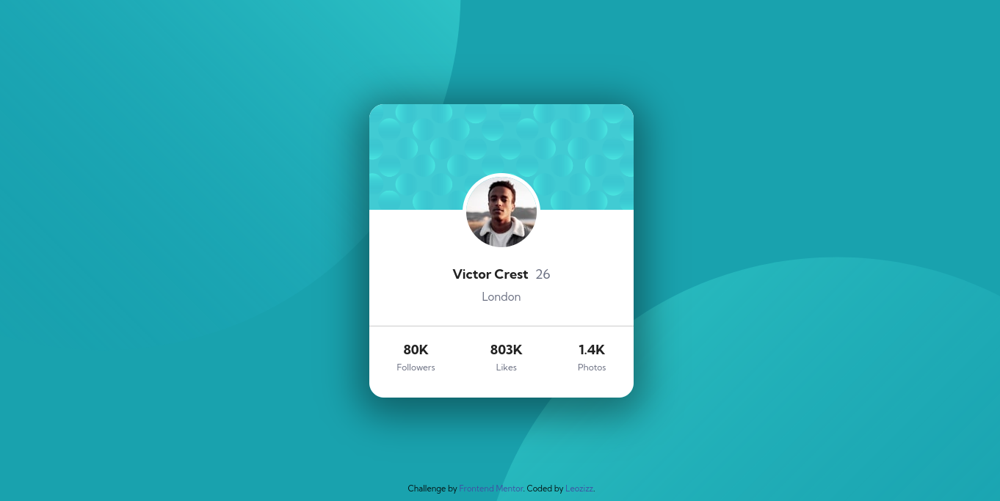

# Frontend Mentor - Profile Card Component solution

This is a solution to the [Profile Card Component challenge on Frontend Mentor](https://www.frontendmentor.io/challenges/profile-card-component-cfArpWshJ). Frontend Mentor challenges help you improve your coding skills by building realistic projects. 

## Table of contents

- [Overview](#overview)
  - [The challenge](#the-challenge)
  - [Screenshot](#screenshot)
  - [Links](#links)
- [My process](#my-process)
  - [Built with](#built-with)
  - [Continued development](#continued-development)
- [Author](#author)
- [Acknowledgments](#acknowledgments)

## Overview

### The challenge

The challenge is to build out a profile card component and get it looking as close to the design as possible.

Any tools can be used to complete the challenge.

Users should be able to:

- View the optimal layout for the page depending on their device's screen size

### Screenshots

#### Desktop Preview

#### Mobile Preview

### Links

- Solution URL: [Profile Card Component - Leozizz GitHub]()
- Live Site URL: [Profile Card Component - Leozizz ](https://leozizz.github.io/profile-card-component/)

## My process

### Built with

- HTML5
- CSS custom properties
- CSS Flexbox

### Continued development

Currently II am studying more and more every day and I intend to improve my skills so that I can improve this and other projects in the future.

## Author

- Website - [Leonardo Silva - leozizz](https://leozizz.github.io)
- GitHub - [leozizz](https://github.com/leozizz)
- Frontend Mentor - [@leozizz](https://www.frontendmentor.io/profile/leozizz)

## Acknowledgments

I thank the entire [**Dev em Dobro**](https://www.instagram.com/devemdobro/) team that has been helping me through the **DevQuest** training where I am having the opportunity to learn and improve my skills in Front-end development and for all the mentoring and help available.